# XGBoost-classification
This project demonstrates the use of XGBoost for predictive maintenance, focusing on handling class imbalance in the dataset. Predictive maintenance aims to predict when equipment failure might occur, allowing for timely maintenance to prevent unexpected downtime. The dataset used in this project contains various features related to machine performance and failure instances.

The notebook includes steps for data preprocessing, feature engineering, model training, hyperparameter tuning using GridSearchCV, and evaluation of the model's performance. The goal is to build a robust classifier that can accurately predict machine failures, even in the presence of imbalanced classes.

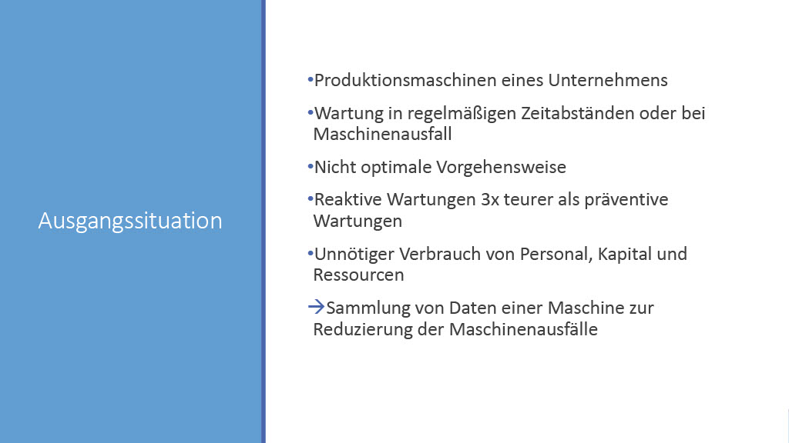
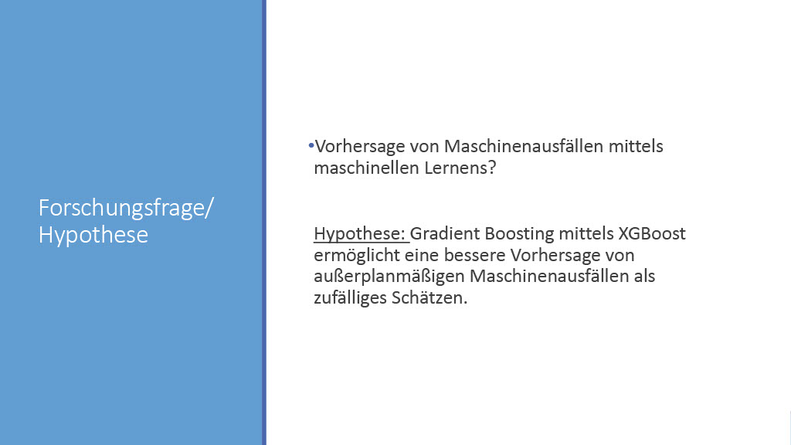

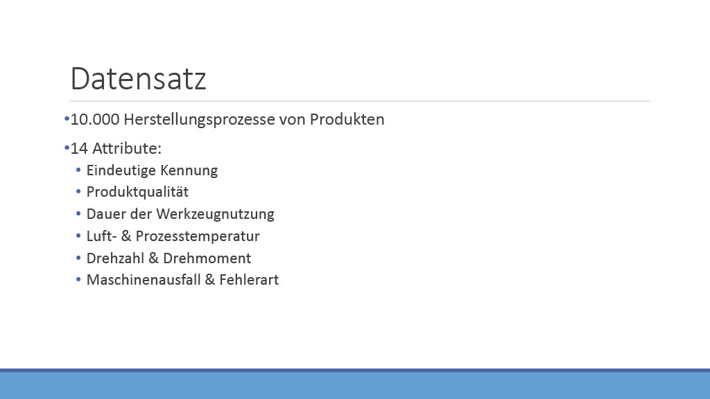
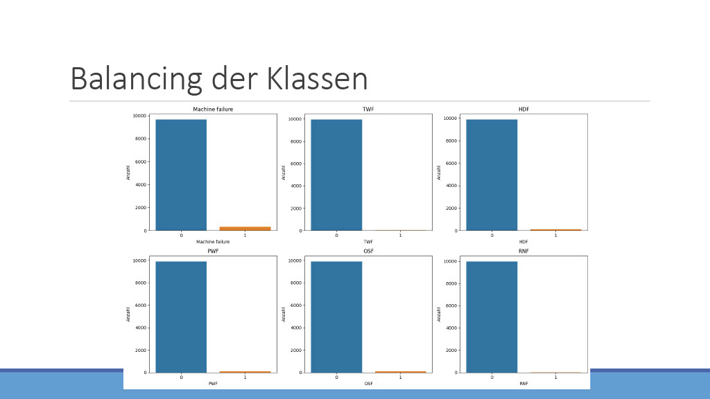
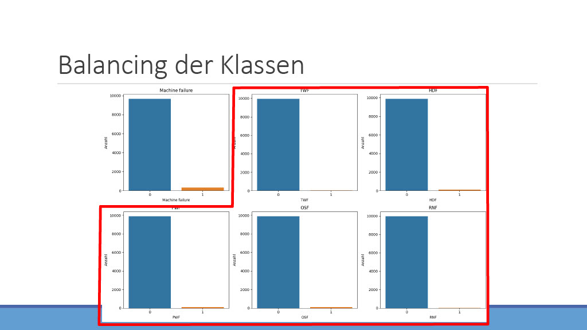
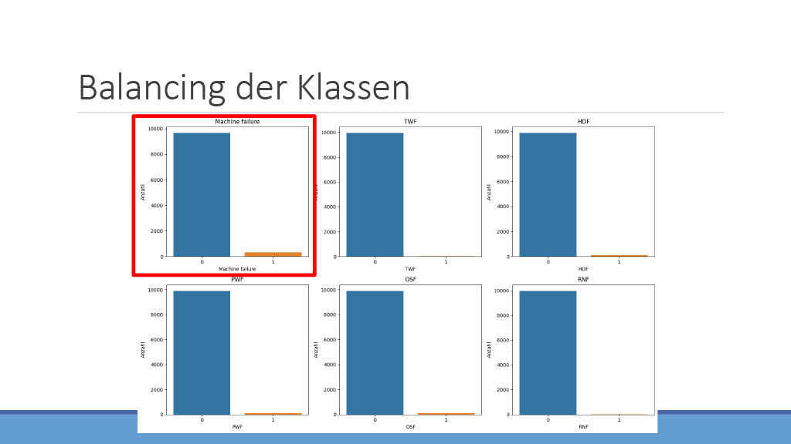
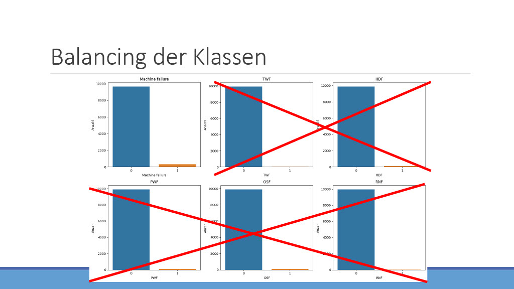
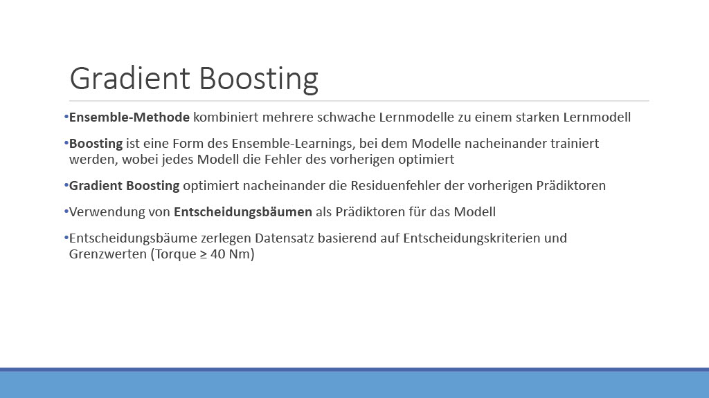
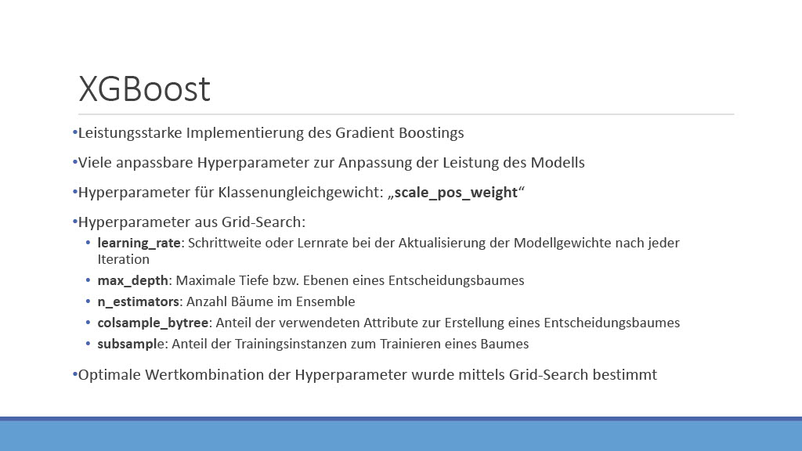
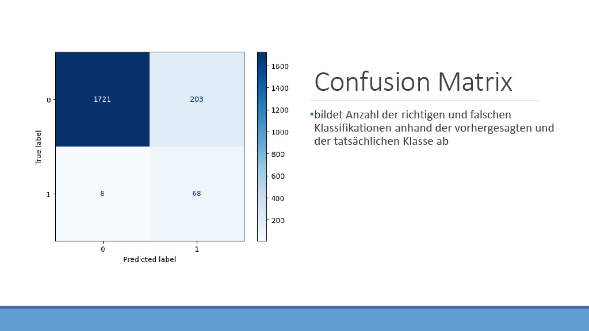
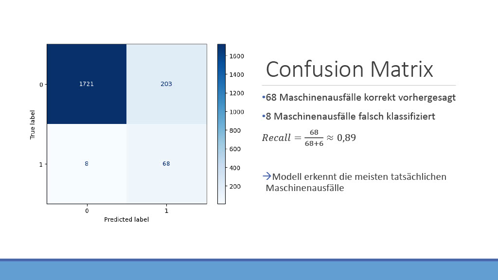
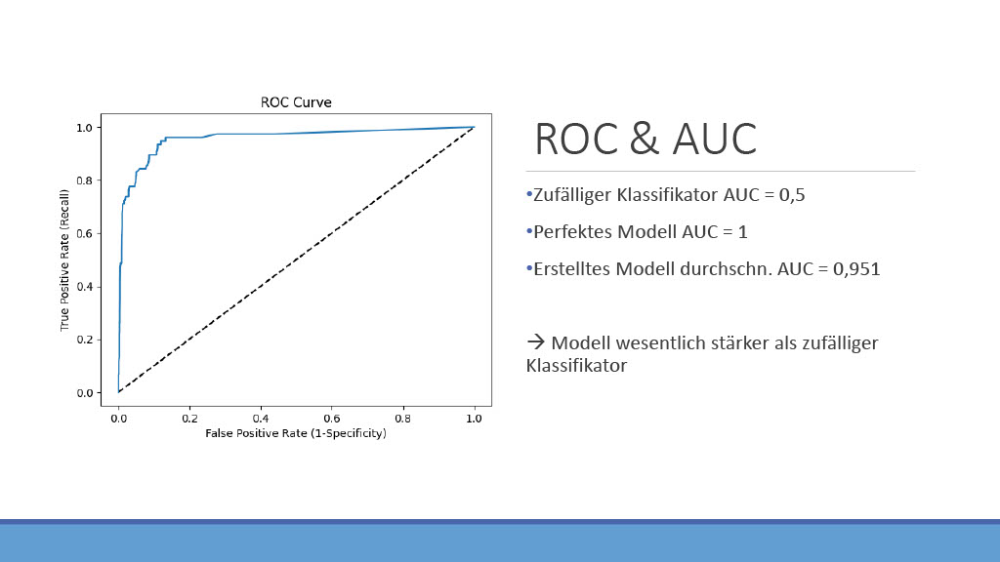
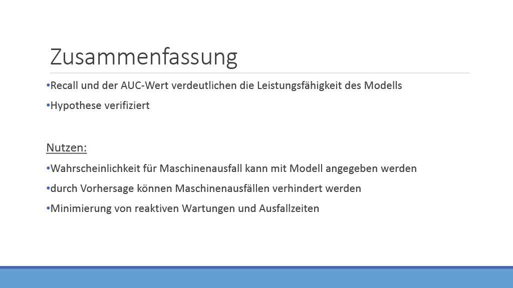
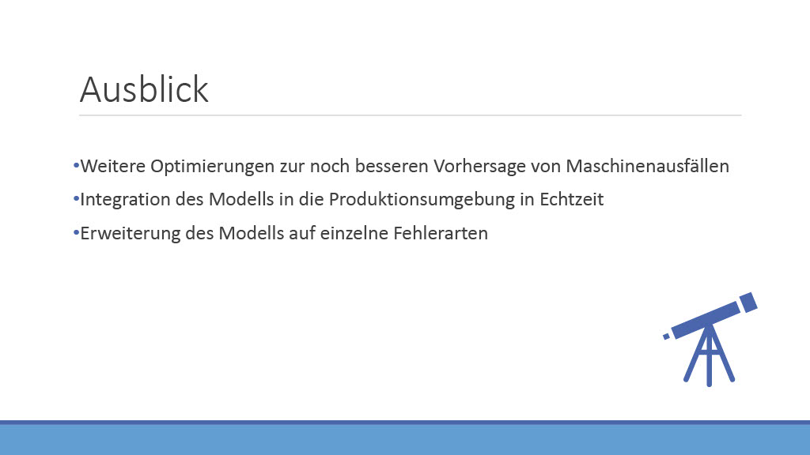
